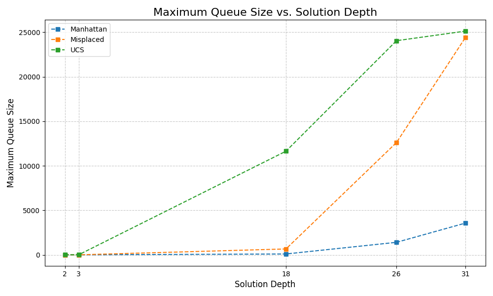
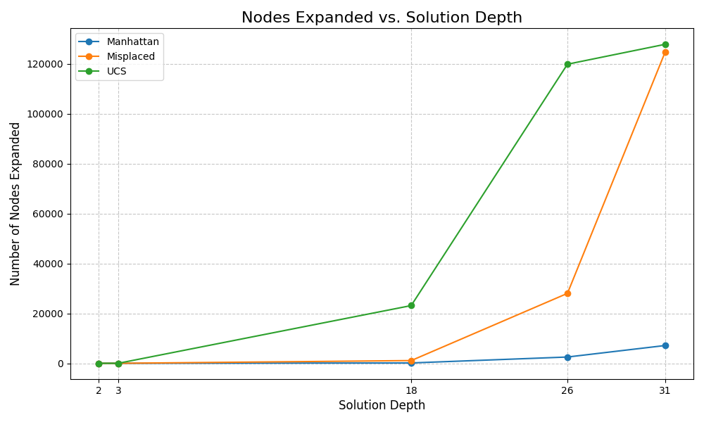

# CS205-eight-puzzle

## Overview

- This project is done for Project 1 of CS205
- This project includes the implementation of Uniform Cost Search, A* with Misplace Tile Heuristic, A* with Manhattan Heuristic
- It outputs the depth of solution, nodes expanded for the solution to compare the performance of each algorithm.

## File Desciption

- driver.py
  - Driver file. It imports uniform_cost_search_handler.py, and manhattan_misplace_handler.py.
- uniform_cost_search_handler.py
  - The class is the implementation of Uniform Cost Search
- manhattan_misplace_handler.py
  - The class is the implementation of A\* with Manhattan and Misplace Tile Heuristic Algorithms.

## How To Execute

`python3 driver.py`
`python3 driver_for_static.py`
`python3 visualize.py`

## Performance Comparison

